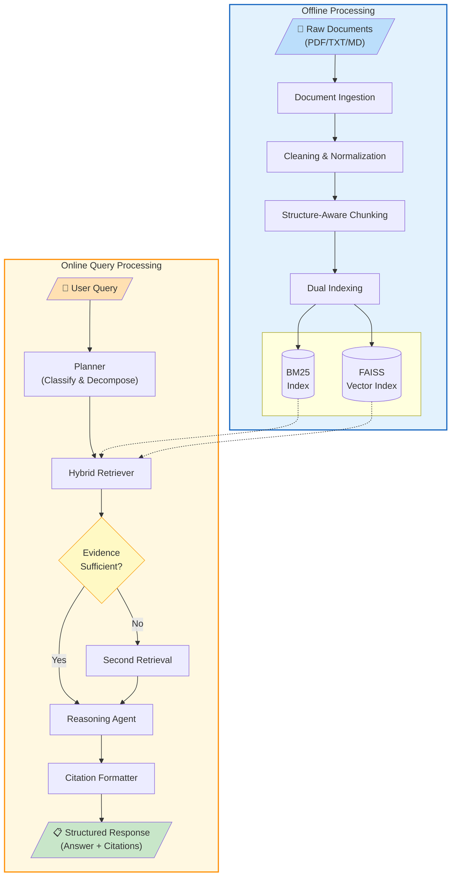
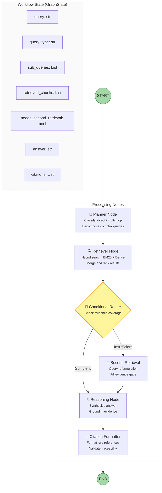

# Figures for Interim Report

## Figure 1: System Architecture Diagram

**Figure 1: System Architecture Overview**
- The system consists of two main phases: offline document processing (blue) and online query processing (yellow)
- Offline phase: Documents are ingested, cleaned, chunked with structure preservation, and indexed using both BM25 and dense embeddings
- Online phase: User queries flow through a planner, hybrid retriever, optional second retrieval, reasoning agent, and citation formatter
- Dashed lines indicate index access during retrieval

---

## Figure 2: LangGraph Workflow Diagram

**Figure 2: LangGraph Agent Workflow**
- The workflow uses LangGraph StateGraph for conditional branching
- **Planner**: Classifies queries and decomposes multi-hop questions
- **Retriever**: Performs hybrid search across both indexes
- **Conditional Router**: Decides whether second retrieval is needed based on evidence coverage
- **Reasoning**: Generates citation-grounded answers using DeepSeek Reasoner
- **State**: Maintains query context, retrieved chunks, and intermediate results across nodes

---

## Notes for Figure Rendering

**Figure 1 Rendering Tips:**
- Use TB (top-bottom) layout for better fit in A4/Letter paper
- Recommended width: 500-600px (fits single column)
- Blue region = offline processing, Yellow region = online processing
- Export as PNG/SVG at 150-200 DPI for print quality

**Figure 2 Rendering Tips:**
- Recommended width: 450-550px
- The State box shows data that flows through the workflow
- Green circles = entry/exit points
- Yellow diamond = decision point
- Export as PNG/SVG at 150-200 DPI for print quality

**Mermaid Export Instructions:**
1. Go to https://mermaid.live/
2. Paste the code block
3. Click "Download PNG" or "Download SVG"
4. For Word: Insert → Pictures → select the downloaded file
5. Recommended DPI: 150-200 for clear print output
