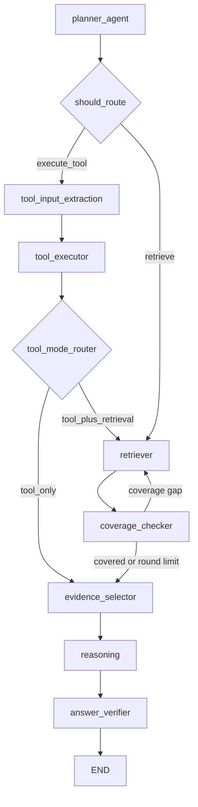

# HKEX Agentic RAG - 架构图与流程图

> 本文档详细描述系统的整体架构、LangGraph 工作流、路由决策逻辑和数据流转。

## Current Production Workflow (Authoritative)

The production `/chat` and `/chat/stream` endpoints use
`app/agents/agentic_workflow.py`. It is an eight-node LangGraph workflow with a
heuristic `PlannerAgent`; it does not use the removed LLM route validator or task
decomposer.



On the first retrieval, `retriever` uses the planner query or sub-queries. When
coverage is incomplete and the two-round limit has not been reached, the same
node switches to targeted mode: it rewrites `retrieval_targets` with the
heuristic `QueryRewriter`, retrieves only the missing topics, and excludes chunk
IDs already accumulated in state. Each round records its queries, new chunk IDs,
and before/after coverage.

`evidence_selector` is the evidence boundary for downstream processing. Answer
synthesis, citation formatting, and answer verification all consume the selected
chunks. Tool-only requests bypass retrieval and coverage as before.

> The diagrams below document earlier prototypes and are retained for historical
> context. References to `llm_route_planner_node`, `route_validator_node`,
> `task_decomposer_node`, or a standalone `second_retrieval_node` are not the
> current production graph.

---

## 1. 系统总体架构

```
┌─────────────────────────────────────────────────────────────────────────────────┐
│                              HKEX Agentic RAG System                            │
├─────────────────────────────────────────────────────────────────────────────────┤
│                                                                                 │
│  ┌──────────────┐     ┌──────────────────────────────────────────────────────┐  │
│  │   FastAPI     │     │              LangGraph Orchestrator                  │  │
│  │              │     │                                                      │  │
│  │  POST /chat  │────▶│  ┌─────────┐  ┌──────────┐  ┌───────────────────┐   │  │
│  │  GET /health │     │  │ Planner │─▶│Retriever │─▶│Coverage Checker   │   │  │
│  │              │     │  └─────────┘  └──────────┘  └───────────────────┘   │  │
│  └──────────────┘     │       │              ▲               │              │  │
│                       │       │              │               ▼              │  │
│                       │       │        ┌─────┴──────┐ ┌─────────────────┐   │  │
│                       │       │        │2nd Retrieval│ │Evidence Selector│   │  │
│                       │       │        └────────────┘ └─────────────────┘   │  │
│                       │       │                               │              │  │
│                       │       │                               ▼              │  │
│                       │       │                      ┌────────────────┐      │  │
│                       │       │                      │Reasoning Agent │      │  │
│                       │       │                      └────────────────┘      │  │
│                       │       │                               │              │  │
│                       │       │                               ▼              │  │
│                       │       │                      ┌────────────────┐      │  │
│                       │       │                      │Answer Verifier │      │  │
│                       │       │                      └────────────────┘      │  │
│                       │       │                               │              │  │
│                       └───────┼───────────────────────────────┼──────────────┘  │
│                               │                               │                 │
│  ┌────────────────────────────┼───────────────────────────────┼──────────────┐  │
│  │                    Data Layer                               ▼              │  │
│  │  ┌──────────────┐  ┌──────────────┐  ┌──────────────┐  ┌──────────┐     │  │
│  │  │ FAISS Index  │  │ BM25 Index   │  │  Chunks DB   │  │ Response │     │  │
│  │  │ (Semantic)   │  │ (Lexical)    │  │  (JSON)      │  │          │     │  │
│  │  └──────────────┘  └──────────────┘  └──────────────┘  └──────────┘     │  │
│  └───────────────────────────────────────────────────────────────────────────┘  │
│                                                                                 │
└─────────────────────────────────────────────────────────────────────────────────┘
```

---

## 2. V1 工作流程图 (生产环境)

V1 是当前生产环境使用的工作流，通过 `POST /chat` 暴露。使用启发式 (heuristic) Planner 进行查询分类。

```
                            ┌─────────────┐
                            │   START     │
                            │ User Query  │
                            └──────┬──────┘
                                   │
                                   ▼
                     ┌─────────────────────────────┐
                     │      planner_node           │
                     │                             │
                     │  • 正则匹配分类 query_type   │
                     │    (direct / multi_hop)     │
                     │  • 7类 intent 识别          │
                     │  • 生成 sub_queries         │
                     │  • 决定 retrieval_strategy  │
                     └──────────────┬──────────────┘
                                    │
                                    ▼
                     ┌─────────────────────────────┐
                     │      retriever_node         │
                     │                             │
                     │  • BM25 词法检索            │
                     │  • Dense 语义检索           │
                     │  • 分数归一化 + 融合         │
                     │  • 返回 top_k 结果          │
                     └──────────────┬──────────────┘
                                    │
                                    ▼
                     ┌─────────────────────────────┐
                     │   coverage_checker_node     │
                     │                             │
                     │  • 规则号匹配               │
                     │  • 标题重叠度计算            │
                     │  • 文本相似度评估            │
                     │  • 输出 coverage_score      │
                     └──────────────┬──────────────┘
                                    │
                                    ▼
                          ┌─────────────────┐
                          │  should_continue │ ◀── 条件路由
                          │  ?              │
                          └────┬───────┬────┘
                               │       │
                   ┌───────────┘       └───────────┐
                   │ YES                           │ NO
                   │ (覆盖不足                     │ (覆盖充分
                   │  且 round < 1                 │  或已重试)
                   │  且 needs_second_retrieval)   │
                   ▼                               ▼
     ┌─────────────────────────┐    ┌─────────────────────────────┐
     │  second_retrieval_node  │    │   evidence_selector_node    │
     │                         │    │                             │
     │  • 针对未覆盖子任务      │    │  • 规则号优先排序           │
     │  • 生成补充查询          │    │  • 去重 + 多样性计算        │
     │  • 再次混合检索          │    │  • 限制 max_chunks         │
     └───────────┬─────────────┘    └──────────────┬──────────────┘
                 │                                  │
                 │ (回到 coverage_checker)           │
                 └─────────────▶ (上方)              ▼
                                     ┌─────────────────────────────┐
                                     │      reasoning_node         │
                                     │                             │
                                     │  • LLM 基于证据生成答案      │
                                     │  • 包含规则引用             │
                                     │  • 不确定性标注             │
                                     │  • 回退: 模板拼接           │
                                     └──────────────┬──────────────┘
                                                    │
                                                    ▼
                                     ┌─────────────────────────────┐
                                     │   answer_verifier_node      │
                                     │                             │
                                     │  • 提取答案中的声明         │
                                     │  • 验证每个声明有证据支持    │
                                     │  • 检测数值/条件/范围矛盾   │
                                     │  • 输出 confidence_level    │
                                     └──────────────┬──────────────┘
                                                    │
                                                    ▼
                                            ┌──────────────┐
                                            │     END      │
                                            │ ChatResponse │
                                            └──────────────┘
```

### V1 条件路由逻辑 (`should_continue`)

```python
def should_continue(state):
    """决定是否需要第二轮检索"""
    IF state["coverage_assessment"].needs_targeted_retrieval == True
       AND state["retrieval_round"] < 1
       AND state["planner_output"].needs_second_retrieval == True:
        RETURN "second_retrieval"   # → 路由到 second_retrieval_node
    ELSE:
        RETURN "evidence_selector"  # → 路由到 evidence_selector_node
```

---

## 3. V2 工作流程图 (高级版)

V2 在 V1 基础上增加了 **LLM 路由决策** 和 **任务分解** 阶段，支持更复杂的多跳推理。

```
                            ┌──────────────┐
                            │    START     │
                            │  User Query  │
                            └──────┬───────┘
                                   │
                                   ▼
               ┌───────────────────────────────────────┐
               │        llm_route_planner_node         │
               │                                       │
               │  • LLM 分析查询复杂度                  │
               │  • 输出 RouteDecision:                │
               │    - query_type                       │
               │    - intent                           │
               │    - requires_decomposition           │
               │    - retrieval_strategy               │
               │    - tool_decision                    │
               │  • 回退: 使用 PlannerAgent 启发式     │
               └───────────────────┬───────────────────┘
                                   │
                                   ▼
               ┌───────────────────────────────────────┐
               │        route_validator_node           │
               │                                       │
               │  • 验证路由决策合理性                   │
               │  • 检查字段冲突                        │
               │  • 输出: is_valid, warnings           │
               │  • 若 should_fallback → 降级为启发式   │
               └───────────────────┬───────────────────┘
                                   │
                                   ▼
                         ┌─────────────────┐
                         │should_decompose? │ ◀── 条件路由
                         └────┬────────┬───┘
                              │        │
              ┌───────────────┘        └────────────────┐
              │ YES                                     │ NO
              │ (requires_decomposition=True            │ (直接检索即可)
              │  且 llm_confidence > 0.7)              │
              ▼                                        │
┌─────────────────────────────┐                        │
│   task_decomposer_node      │                        │
│                             │                        │
│  • 分解为子任务 DAG          │                        │
│  • 每个 SubTask:            │                        │
│    - type (retrieval/tool)  │                        │
│    - goal, query            │                        │
│    - depends_on (依赖关系)   │                        │
│  • merge_strategy           │                        │
│  • 回退: and/or 拆分        │                        │
└──────────────┬──────────────┘                        │
               │                                       │
               ▼                                       │
┌─────────────────────────────┐                        │
│ decomposition_validator_node│                        │
│                             │                        │
│  • 检查 DAG 是否有环        │                        │
│  • 验证任务完整性            │                        │
│  • 检测孤立节点             │                        │
└──────────────┬──────────────┘                        │
               │                                       │
               └───────────────┬───────────────────────┘
                               │
                               ▼
               ┌───────────────────────────────────────┐
               │          retriever_node               │
               │                                       │
               │  • 对每个 sub_query/subtask 检索      │
               │  • BM25 + Dense 融合                  │
               │  • 跨查询去重 (保留最高分)             │
               └───────────────────┬───────────────────┘
                                   │
                                   ▼
               ┌───────────────────────────────────────┐
               │      coverage_checker_node            │
               └───────────────────┬───────────────────┘
                                   │
                                   ▼
                         ┌─────────────────┐
                         │  should_continue │ ◀── 循环控制
                         │  ?  (round < 2) │
                         └────┬────────┬───┘
                              │        │
              YES (补充检索)    │        │  NO (继续)
              ┌───────────────┘        └────────────────┐
              ▼                                         ▼
┌─────────────────────────┐          ┌─────────────────────────────┐
│ second_retrieval_node   │──(回到   │   evidence_selector_node    │
│ (targeted iterative)    │ coverage)└──────────────┬──────────────┘
└─────────────────────────┘                         │
                                                    ▼
                                     ┌─────────────────────────────┐
                                     │      reasoning_node         │
                                     └──────────────┬──────────────┘
                                                    │
                                                    ▼
                                     ┌─────────────────────────────┐
                                     │   answer_verifier_node      │
                                     └──────────────┬──────────────┘
                                                    │
                                                    ▼
                                            ┌──────────────┐
                                            │     END      │
                                            │ ChatResponse │
                                            └──────────────┘
```

---

## 4. 路由决策详解 (Route Decision)

路由是本系统 "Agentic" 的核心体现。系统不是简单地 "检索 → 生成"，而是先 **分析查询意图**，再 **选择执行路径**。

### 4.1 路由决策的三层架构

```
┌─────────────────────────────────────────────────────────────────┐
│                     路由决策三层架构                               │
├─────────────────────────────────────────────────────────────────┤
│                                                                 │
│  Layer 1: 意图分类 (Intent Classification)                       │
│  ┌───────────────────────────────────────────────────────────┐  │
│  │  rule_lookup │ obligation_summary │ comparison            │  │
│  │  eligibility_check │ procedure_flow │ calculation_required│  │
│  │  general                                                  │  │
│  └───────────────────────────────────────────────────────────┘  │
│                            │                                    │
│                            ▼                                    │
│  Layer 2: 策略选择 (Strategy Selection)                          │
│  ┌───────────────────────────────────────────────────────────┐  │
│  │  single_pass: 单次检索足够                                  │  │
│  │  multi_query: 需要多个子查询并行检索                         │  │
│  │  targeted_iterative: 需要多轮迭代，逐步补齐                  │  │
│  └───────────────────────────────────────────────────────────┘  │
│                            │                                    │
│                            ▼                                    │
│  Layer 3: 分解决策 (Decomposition Decision)                      │
│  ┌───────────────────────────────────────────────────────────┐  │
│  │  requires_decomposition: True/False                        │  │
│  │  tool_decision: none / tool_only / tool_plus_retrieval    │  │
│  └───────────────────────────────────────────────────────────┘  │
│                                                                 │
└─────────────────────────────────────────────────────────────────┘
```

### 4.2 意图 → 策略 → 行为映射

```
┌──────────────────┬─────────────────────┬──────────┬───────────┬──────────┐
│ Intent           │ Retrieval Strategy  │ 评分依据  │ Max Chunks│ 是否分解  │
├──────────────────┼─────────────────────┼──────────┼───────────┼──────────┤
│ rule_lookup      │ single_pass         │ BM25     │ 5         │ No       │
│ obligation_sum   │ multi_query         │ Dense    │ 6         │ Maybe    │
│ comparison       │ targeted_iterative  │ Fused    │ 8         │ Yes      │
│ eligibility      │ single_pass         │ Fused    │ 5         │ Maybe    │
│ procedure_flow   │ multi_query         │ Fused    │ 8         │ Maybe    │
│ calculation      │ targeted_iterative  │ Fused    │ 5         │ Yes+Tool │
│ general          │ single_pass         │ Fused    │ 5         │ No       │
└──────────────────┴─────────────────────┴──────────┴───────────┴──────────┘
```

### 4.3 查询分类决策树 (Heuristic Planner)

```
                        ┌───────────────┐
                        │  Input Query  │
                        └───────┬───────┘
                                │
                    ┌───────────┴───────────┐
                    │ 正则规则匹配 (Regex)    │
                    └───────────┬───────────┘
                                │
            ┌───────────────────┼───────────────────┐
            ▼                   ▼                   ▼
   ┌────────────────┐  ┌────────────────┐  ┌────────────────┐
   │ 包含规则编号    │  │ 比较类关键词    │  │ 计算类关键词    │
   │ "Rule 14A.08"  │  │ "区别","比较"   │  │ "计算","百分比" │
   │ "第19章"       │  │ "difference"   │  │ "calculate"    │
   └───────┬────────┘  └───────┬────────┘  └───────┬────────┘
           │                   │                   │
           ▼                   ▼                   ▼
    intent=rule_lookup  intent=comparison   intent=calculation
                                │
                                ▼
                    ┌───────────────────────┐
                    │  Multi-hop 检测逻辑    │
                    │                       │
                    │  IF:                   │
                    │  • >1个规则编号 OR     │
                    │  • >2个条款号 OR       │
                    │  • AND/OR 连接词       │
                    │  THEN: multi_hop      │
                    │  ELSE: direct         │
                    └───────────────────────┘
```

### 4.4 V2 LLM 路由 + 回退机制

```
┌─────────────────────────────────────────────────────────────────┐
│                  V2 LLM Route Planning                           │
├─────────────────────────────────────────────────────────────────┤
│                                                                 │
│   ┌─────────────┐                                               │
│   │  LLM Call   │ ◀── System Prompt: 分析查询复杂度              │
│   └──────┬──────┘                                               │
│          │                                                      │
│          ├── SUCCESS ──▶ RouteDecision                           │
│          │               ├─ query_type: "direct"|"multi_hop"    │
│          │               ├─ intent: 7类之一                      │
│          │               ├─ requires_decomposition: bool        │
│          │               ├─ retrieval_strategy: str             │
│          │               ├─ llm_confidence: 0.0~1.0             │
│          │               └─ tool_decision: ToolDecision         │
│          │                                                      │
│          └── FAILURE ──▶ ┌────────────────────────┐             │
│                          │  Fallback to Heuristic │             │
│                          │  PlannerAgent.classify()│             │
│                          │  fallback_used = True  │             │
│                          │  llm_confidence = 0.0  │             │
│                          └────────────────────────┘             │
│                                                                 │
│   Route Validation:                                             │
│   ┌──────────────────────────────────────┐                      │
│   │ • query_type 与 intent 是否矛盾?      │                      │
│   │ • tool_decision 字段是否一致?          │                      │
│   │ • should_retry → 重新调用 LLM         │                      │
│   │ • should_fallback → 降级为启发式      │                      │
│   └──────────────────────────────────────┘                      │
│                                                                 │
└─────────────────────────────────────────────────────────────────┘
```

---

## 5. 混合检索流程 (Hybrid Retrieval)

```
                          ┌──────────────┐
                          │ Query String │
                          └──────┬───────┘
                                 │
                 ┌───────────────┴───────────────┐
                 │                               │
                 ▼                               ▼
    ┌────────────────────────┐     ┌────────────────────────┐
    │     BM25 Search        │     │    Dense Search         │
    │                        │     │                        │
    │  • 词法匹配            │     │  • Embedding 编码      │
    │  • TF-IDF 权重         │     │  • FAISS 向量相似度    │
    │  • 精确关键词匹配好     │     │  • 语义理解能力强      │
    │  • top_k 候选           │     │  • top_k 候选          │
    └────────────┬───────────┘     └────────────┬───────────┘
                 │                               │
                 ▼                               ▼
    ┌────────────────────────┐     ┌────────────────────────┐
    │   Score Normalization  │     │   Score Normalization  │
    │                        │     │                        │
    │  norm = (s - min)      │     │  norm = (s - min)      │
    │        / (max - min)   │     │        / (max - min)   │
    └────────────┬───────────┘     └────────────┬───────────┘
                 │                               │
                 └───────────────┬───────────────┘
                                 │
                                 ▼
                  ┌──────────────────────────────┐
                  │       Score Fusion           │
                  │                              │
                  │  fused = bm25_weight × BM25  │
                  │        + dense_weight × Dense│
                  │                              │
                  │  默认: bm25=0.4, dense=0.6   │
                  └──────────────┬───────────────┘
                                 │
                                 ▼
                  ┌──────────────────────────────┐
                  │      Top-K Selection         │
                  │                              │
                  │  排序后取 top_k_final (=10)   │
                  │  返回 List[RetrievalResult]  │
                  └──────────────────────────────┘
```

### 多查询去重逻辑

```
FOR each sub_query in sub_queries:
    results = hybrid_retrieve(sub_query)
    FOR each result in results:
        IF result.chunk_id NOT IN all_results:
            all_results[chunk_id] = result        # 新增
        ELIF result.score > all_results[chunk_id].score:
            all_results[chunk_id] = result        # 保留更高分
        ELSE:
            skip                                  # 丢弃低分重复

RETURN sorted(all_results.values(), by=score, desc=True)[:top_k_final]
```

---

## 6. 覆盖检查与迭代检索

```
┌─────────────────────────────────────────────────────────────┐
│              Coverage Assessment Flow                         │
├─────────────────────────────────────────────────────────────┤
│                                                             │
│  FOR each sub_task in planner_output.sub_tasks:             │
│                                                             │
│    ┌─────────────────────────────────────────────────┐      │
│    │ Signal 1: 规则号匹配 (Rule Number Match)         │      │
│    │ • chunk.rule_number == sub_task mentioned rule   │      │
│    │ • 若命中 → 标记 COVERED (最高优先级)             │      │
│    └─────────────────────┬───────────────────────────┘      │
│                          │ 未命中                            │
│                          ▼                                  │
│    ┌─────────────────────────────────────────────────┐      │
│    │ Signal 2: 标题重叠 (Section Title Overlap)       │      │
│    │ • overlap = similarity(query_tokens, section)    │      │
│    │ • 若 overlap ≥ 0.4 → 标记 COVERED               │      │
│    └─────────────────────┬───────────────────────────┘      │
│                          │ 未命中                            │
│                          ▼                                  │
│    ┌─────────────────────────────────────────────────┐      │
│    │ Signal 3: 文本重叠 (Text Overlap Score)          │      │
│    │ • similarity(query, chunk.content)              │      │
│    │ • 若 ≥ 0.3 → 标记 COVERED                       │      │
│    └─────────────────────┬───────────────────────────┘      │
│                          │ 未命中                            │
│                          ▼                                  │
│                    标记 UNCOVERED                             │
│                                                             │
│  ─────────────────────────────────────────────────────────  │
│                                                             │
│  coverage_score = covered_count / total_sub_tasks           │
│                                                             │
│  IF coverage_score < threshold AND round < max_rounds:      │
│    → needs_targeted_retrieval = True                        │
│    → 触发 second_retrieval (针对 uncovered 子任务)           │
│  ELSE:                                                      │
│    → 继续到 evidence_selector                               │
│                                                             │
└─────────────────────────────────────────────────────────────┘
```

---

## 7. 证据选择与答案验证

### 7.1 证据选择 (Evidence Selector)

```
┌─────────────────────────────────────────────────────────┐
│            Evidence Selection Pipeline                    │
├─────────────────────────────────────────────────────────┤
│                                                         │
│  Input: All retrieved_chunks (accumulated across rounds) │
│                                                         │
│  Step 1: 去重                                           │
│  ┌───────────────────────────────────┐                  │
│  │ 按 chunk_id 去重，保留最高分       │                  │
│  └───────────────────┬───────────────┘                  │
│                      │                                  │
│  Step 2: 优先排序                                       │
│  ┌───────────────────────────────────┐                  │
│  │ Group A: 有 rule_number 的 chunks │ ← 优先          │
│  │ Group B: 无 rule_number 的 chunks │                  │
│  │ 组内按 score DESC 排序            │                  │
│  └───────────────────┬───────────────┘                  │
│                      │                                  │
│  Step 3: 截断                                           │
│  ┌───────────────────────────────────┐                  │
│  │ direct + 普通 → max 5 chunks      │                  │
│  │ multi_hop + 普通 → max 6 chunks   │                  │
│  │ multi_hop + comparison → max 8    │                  │
│  │ multi_hop + procedure → max 8     │                  │
│  └───────────────────┬───────────────┘                  │
│                      │                                  │
│  Step 4: 多样性评估                                     │
│  ┌───────────────────────────────────┐                  │
│  │ diversity = 0.6 × rule_diversity  │                  │
│  │           + 0.4 × section_diversity│                  │
│  └───────────────────────────────────┘                  │
│                                                         │
└─────────────────────────────────────────────────────────┘
```

### 7.2 答案验证 (Answer Verifier)

```
┌─────────────────────────────────────────────────────────────────┐
│                   Answer Verification Pipeline                    │
├─────────────────────────────────────────────────────────────────┤
│                                                                 │
│  ┌────────────────────────────────────────────────────────┐     │
│  │ Step 1: 声明提取 (Claim Extraction)                     │     │
│  │                                                        │     │
│  │  Pattern A: 中文条件句 "如果...则..."                    │     │
│  │  Pattern B: 数值阈值 "超过X%", "不超过Y%"               │     │
│  │  Pattern C: 义务/禁止 "必须", "应当", "禁止"            │     │
│  │  Pattern D: 陈述句拆分                                  │     │
│  └────────────────────────────┬───────────────────────────┘     │
│                               │                                 │
│                               ▼                                 │
│  ┌────────────────────────────────────────────────────────┐     │
│  │ Step 2: 支持度验证 (Support Verification)               │     │
│  │                                                        │     │
│  │  FOR each claim:                                       │     │
│  │    threshold = 0.6 (短句) / 0.5 (中句) / 0.4 (长句)    │     │
│  │    support = count(chunk where sim ≥ threshold)         │     │
│  │    support_ratio = support / total_chunks              │     │
│  └────────────────────────────┬───────────────────────────┘     │
│                               │                                 │
│                               ▼                                 │
│  ┌────────────────────────────────────────────────────────┐     │
│  │ Step 3: 矛盾检测 (Contradiction Detection)             │     │
│  │                                                        │     │
│  │  Type 1: 数值矛盾                                      │     │
│  │    "不超过5%" vs "超过3%" → CONFLICT                   │     │
│  │                                                        │     │
│  │  Type 2: 条件矛盾                                      │     │
│  │    同条件 → 相反结果 → CONFLICT                        │     │
│  │                                                        │     │
│  │  Type 3: 范围矛盾                                      │     │
│  │    "适用" vs "豁免" 同一规则 → CONFLICT                 │     │
│  └────────────────────────────┬───────────────────────────┘     │
│                               │                                 │
│                               ▼                                 │
│  ┌────────────────────────────────────────────────────────┐     │
│  │ Step 4: 置信度判定                                      │     │
│  │                                                        │     │
│  │  confidence = HIGH    if support_ratio ≥ 0.8 & n ≥ 3  │     │
│  │             = MEDIUM  if support_ratio ≥ 0.5           │     │
│  │             = LOW     otherwise                        │     │
│  └────────────────────────────────────────────────────────┘     │
│                                                                 │
└─────────────────────────────────────────────────────────────────┘
```

---

## 8. 完整数据流 (端到端)

```
┌──────────────────────────────────────────────────────────────────────────┐
│                        End-to-End Data Flow                               │
├──────────────────────────────────────────────────────────────────────────┤
│                                                                          │
│  User: "Main Board和GEM的关连交易披露门槛有什么区别?"                       │
│                                                                          │
│  ══════════════════════════════════════════════════════════════════════   │
│                                                                          │
│  [1] PLANNER                                                             │
│      ├─ intent: "comparison"                                             │
│      ├─ query_type: "multi_hop"                                          │
│      ├─ sub_queries: ["Main Board connected transaction disclosure       │
│      │                threshold", "GEM connected transaction disclosure   │
│      │                threshold"]                                         │
│      ├─ retrieval_strategy: "targeted_iterative"                         │
│      └─ needs_second_retrieval: True                                     │
│                                                                          │
│  ══════════════════════════════════════════════════════════════════════   │
│                                                                          │
│  [2] RETRIEVER (Round 1)                                                 │
│      ├─ Sub-query 1 → BM25 + Dense → 10 candidates                      │
│      ├─ Sub-query 2 → BM25 + Dense → 10 candidates                      │
│      ├─ Dedup + Fusion → 10 final chunks                                 │
│      └─ State: retrieved_chunks += 10                                    │
│                                                                          │
│  ══════════════════════════════════════════════════════════════════════   │
│                                                                          │
│  [3] COVERAGE CHECK                                                      │
│      ├─ Sub-task 1 (Main Board threshold): COVERED (Rule 14A found)      │
│      ├─ Sub-task 2 (GEM threshold): UNCOVERED                            │
│      ├─ coverage_score: 0.5                                              │
│      └─ needs_targeted_retrieval: True → 触发第二轮                       │
│                                                                          │
│  ══════════════════════════════════════════════════════════════════════   │
│                                                                          │
│  [4] RETRIEVER (Round 2 - targeted)                                      │
│      ├─ 针对 "GEM connected transaction disclosure threshold"            │
│      ├─ BM25 + Dense → 补充 chunks                                       │
│      └─ State: retrieved_chunks += new chunks (accumulated!)             │
│                                                                          │
│  ══════════════════════════════════════════════════════════════════════   │
│                                                                          │
│  [5] COVERAGE CHECK (Round 2)                                            │
│      ├─ Sub-task 1: COVERED                                              │
│      ├─ Sub-task 2: COVERED (GEM Rule found)                             │
│      ├─ coverage_score: 1.0                                              │
│      └─ needs_targeted_retrieval: False → 继续                           │
│                                                                          │
│  ══════════════════════════════════════════════════════════════════════   │
│                                                                          │
│  [6] EVIDENCE SELECTOR                                                   │
│      ├─ intent=comparison → max_chunks=8                                 │
│      ├─ 规则号优先: Chapter 14A.xx, GEM Rule 20.xx 排前                   │
│      ├─ diversity_score: 0.85 (涵盖两个规则体系)                          │
│      └─ 选出 8 个最相关 chunks                                            │
│                                                                          │
│  ══════════════════════════════════════════════════════════════════════   │
│                                                                          │
│  [7] REASONING                                                           │
│      ├─ LLM 生成对比分析答案                                              │
│      ├─ 引用 Rule 14A.08, GEM Rule 20.04 等                              │
│      └─ 标注引用出处                                                      │
│                                                                          │
│  ══════════════════════════════════════════════════════════════════════   │
│                                                                          │
│  [8] VERIFIER                                                            │
│      ├─ 提取声明: "Main Board threshold is 5%"                           │
│      ├─ 验证: 与 Rule 14A.08 内容一致 ✓                                   │
│      ├─ 矛盾检测: 无矛盾                                                 │
│      └─ confidence_level: "high"                                         │
│                                                                          │
│  ══════════════════════════════════════════════════════════════════════   │
│                                                                          │
│  Response: ChatResponse {                                                │
│    answer: "Main Board和GEM在关连交易方面...",                             │
│    citations: [Rule 14A.08, GEM Rule 20.04, ...],                        │
│    confidence_level: "high",                                             │
│    coverage_assessment: { score: 1.0 },                                  │
│    verification_result: { is_verified: true }                            │
│  }                                                                       │
│                                                                          │
└──────────────────────────────────────────────────────────────────────────┘
```

---

## 9. LangGraph State 状态管理

### 9.1 State 累积机制

LangGraph 使用 **Annotated Reducer** 模式管理状态。关键点在于 `retrieved_chunks`、`citations` 和 `retrieval_rounds` 使用 **add reducer**——意味着每次写入是追加，而非覆盖。

```
┌────────────────────────────────────────────────────────┐
│            AgentState 字段与 Reducer                     │
├────────────────────────────────────────────────────────┤
│                                                        │
│  普通字段 (每次覆盖):                                    │
│  ├─ query: str                                         │
│  ├─ query_type: str                                    │
│  ├─ intent: str                                        │
│  ├─ planner_output: PlannerOutput                      │
│  ├─ coverage_assessment: Dict                          │
│  ├─ selected_evidence: Dict                            │
│  ├─ answer: str                                        │
│  ├─ verification_result: Dict                          │
│  └─ confidence_level: str                              │
│                                                        │
│  累积字段 (ADD reducer, 追加不覆盖):                     │
│  ├─ retrieved_chunks: List[RetrievalResult]  ← 累积    │
│  ├─ citations: List[Citation]                ← 累积    │
│  └─ retrieval_rounds: List[Dict]             ← 累积    │
│                                                        │
│  这意味着:                                              │
│  • 第一轮检索: retrieved_chunks = [chunk1..chunk10]     │
│  • 第二轮检索: retrieved_chunks = [chunk1..chunk10,     │
│                                    chunk11..chunk15]    │
│  • Evidence Selector 看到的是所有轮次的全部结果          │
│                                                        │
└────────────────────────────────────────────────────────┘
```

### 9.2 LangGraph 图定义 (V1)

```python
# 简化的 V1 图结构
graph = StateGraph(AgentState)

# 添加节点
graph.add_node("planner",           planner_node)
graph.add_node("retriever",         retriever_node)
graph.add_node("coverage_checker",  coverage_checker_node)
graph.add_node("second_retrieval",  second_retrieval_node)
graph.add_node("evidence_selector", evidence_selector_node)
graph.add_node("reasoning",         reasoning_node)
graph.add_node("answer_verifier",   answer_verifier_node)

# 添加边
graph.set_entry_point("planner")
graph.add_edge("planner",          "retriever")
graph.add_edge("retriever",        "coverage_checker")
graph.add_conditional_edges(
    "coverage_checker",
    should_continue,            # ← 条件函数
    {
        "second_retrieval": "second_retrieval",
        "evidence_selector": "evidence_selector"
    }
)
graph.add_edge("second_retrieval", "coverage_checker")  # ← 循环!
graph.add_edge("evidence_selector","reasoning")
graph.add_edge("reasoning",        "answer_verifier")
graph.add_edge("answer_verifier",  END)
```

---

## 10. 回退链 (Fallback Chain)

系统的每个 LLM 依赖环节都有回退机制，确保即使 LLM 不可用也能返回结果：

```
┌────────────────────────────────────────────────────────────────────┐
│                      Fallback Chain Design                          │
├────────────────────────────────────────────────────────────────────┤
│                                                                    │
│  ┌──────────────────┐    FAIL    ┌──────────────────────────┐     │
│  │ LLM Route Planner│ ─────────▶ │ Heuristic PlannerAgent   │     │
│  │ (V2)            │            │ (Regex-based classify)    │     │
│  └──────────────────┘            └──────────────────────────┘     │
│                                                                    │
│  ┌──────────────────┐    FAIL    ┌──────────────────────────┐     │
│  │ LLM Decomposer  │ ─────────▶ │ Pattern Split (and/or)   │     │
│  │ (V2)            │            │ Simple fragment tasks     │     │
│  └──────────────────┘            └──────────────────────────┘     │
│                                                                    │
│  ┌──────────────────┐    FAIL    ┌──────────────────────────┐     │
│  │ LLM Reasoning   │ ─────────▶ │ Template Concatenation   │     │
│  │ Agent           │            │ Top chunk as answer       │     │
│  └──────────────────┘            └──────────────────────────┘     │
│                                                                    │
│  设计原则:                                                          │
│  • 每个 LLM 节点都有非 LLM 回退路径                                 │
│  • 回退时设置 fallback_used=True 标记                               │
│  • 答案质量可能降低但系统不会中断                                     │
│  • 测试可以在无 LLM 环境下运行 (use_llm_planner=False)              │
│                                                                    │
└────────────────────────────────────────────────────────────────────┘
```

---

## 11. 关键设计决策总结

| 设计决策 | 选择 | 原因 |
|---------|------|------|
| 检索策略 | BM25 + Dense 混合 | 规则文档有精确编号(需BM25)也有语义查询(需Dense) |
| 状态管理 | LangGraph + Add Reducer | 多轮检索结果需要累积而非覆盖 |
| 路由方式 | 启发式 + LLM双轨 | 启发式快且稳定，LLM更智能但可能失败 |
| 迭代检索 | Coverage-driven loop | 只在覆盖不足时补充，避免无意义的多轮 |
| 证据选择 | 规则号优先 | 合规场景中精确的规则引用比语义相关更有价值 |
| 答案验证 | 三类矛盾检测 | 法律文档中数值、条件、范围矛盾最常见 |
| 回退机制 | 每个LLM节点都有 | 确保系统可测试性和生产可靠性 |
