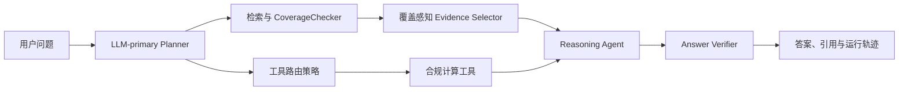

# R2 针对性优化与第二轮评测计划

**状态：** 待确认的实施方案
**前提：** R1（`formal-v1-af51990-20260716`）已经冻结，不修改其测试集、配置或结果。
**目标：** 以小而可解释的改动，改善 Agentic RAG 对复杂法规问题的答案完整性，同时保留其已经验证的工具任务优势。
## 1. 为什么需要 R2

R1 已经给出了一个有价值但并不均衡的结论：

| R1 指标 | B3 传统 RAG | A1 Agentic RAG |
| --- | ---: | ---: |
| 词法答案点覆盖率（诊断指标） | 43.06% | 36.44% |
| 端到端任务成功率 | 约低 6.67 个百分点 | 相对 B3 +6.67 个百分点，95% CI 为 +3.00 至 +10.33 个百分点 |
| 工具任务正确率 | 58.6% | 85.7% |
| 平均延迟 | 8.53 秒 | 10.21 秒 |

这说明当前 Agentic 编排已经显著提升了工具型合规任务的稳定性，却还没有证明它能稳定提高一般法规问答的答案完整性。尤其是，R1 的“答案点覆盖率”是偏词法的自动诊断指标，不能把它直接当作回答质量的最终结论。

R2 的任务不是把系统重写成更复杂的 Agent，而是验证一个清楚的假设：**若 Agent 能确保每个规划出的信息需求都有代表性证据，并且工具答案在需要时补上法规依据，Agentic RAG 是否能同时维持工具优势并改善有依据的答案完整性。**

## 2. R2 的边界与原则

### 做什么

1. 改善复杂问题的证据覆盖，而不是单纯扩大 Top-K。
2. 让“计算结果”与“法规后果”在需要时一起进入最终回答。
3. 使用新的、未参与调参的 `v1.1` 测试集验证结果。
4. 只保留 B3、A1-legacy、A1-new 三组正式比较，结果更容易在论文中解释。

### 不做什么

1. 不修改 R1 的 `v1.0` 题目、金标准、索引或已冻结结果。
2. 不更换语料、切块策略、嵌入模型、RRF 参数或四个既有合规工具。
3. 不恢复已经有意删除的旧 LangGraph 图、路由验证器或任务分解器。
4. 不为了 R2 再跑 A2/A3；R1 已经完成“工具路由”和“工具链”的消融说明。
5. 不把开发试验集的最好成绩写进论文的正式结论。

## 3. 设计概览

R2 只引入两个用户可感知的行为变化，并以一个内部回答约束把它们连起来：

* 对纯计算问题，系统仍可只调用工具，避免无意义检索。
* 对询问法规义务、披露要求、适用规则或法律后果的问题，工具结果必须与检索证据共同参与回答。
* 对多条件、比较、流程或多子问题查询，证据选择器先保证信息需求覆盖，再按规则存在性与相关度补足证据。

## 4. 代码优化方案

### 4.1 工作包 O1：覆盖感知的证据选择

**问题。** 当前 Evidence Selector 的主要逻辑是去重、按规则特征和分数排序、取前 N 个。它可能把多个高分但回答同一子问题的 chunk 都选中，而另一个子问题没有证据。单纯把 N 从 5 调到 8 只能增加上下文长度，不能保证回答覆盖面。

**改动位置。** `app/agents/evidence_selector.py`，以及只用于图运行轨迹的状态诊断字段；不改变 `/chat` 响应契约。

**选择算法。**

1. 从 `planner_output.sub_tasks` 建立待满足的信息需求列表；无子任务时使用整个查询作为一个需求。
2. 对已检索 chunk 先按稳定 chunk ID 去重，并保留 fused、BM25、dense 三种原始分数。
3. 对每个需要检索证据的子任务，优先保留一个最相关且未被选中的 chunk。若某子任务没有可用 chunk，明确记录为未覆盖，而不是用其他主题的 chunk 填充。
4. 用其余预算补足证据：优先明确包含规则条文的 chunk，再按相关度排序；同一规则、同一章节的高度重复内容只保留代表项。
5. 简单单点问题上限为 5 个 chunk；比较、流程、多条件或多个高证据需求的查询上限为 8 个 chunk。上限是固定预算，不随运行波动。
6. 在运行轨迹记录 `requested_subtasks`、`covered_subtasks`、`uncovered_subtasks`、`selected_chunk_ids` 和 `selection_budget`，供测试与评测审计使用；这些字段不必新增到公开 API。

**验收测试。**

* 两个子问题各有一条支持证据时，选择结果至少包含各一条。
* 同一主题的重复高分 chunk 不得挤掉另一子问题的唯一证据。
* 简单查询不超过 5 条，复杂查询不超过 8 条。
* 选择结果继续是 reasoning、citation 和 verification 的唯一检索证据来源。
* 没有 Planner 子任务、没有检索结果及工具专用途径均保持现有安全回退行为。

### 4.2 工作包 O2：让工具结论在需要时具有法规依据

**问题。** 现有 `tool_only` 模式对纯数值计算很有效，但当用户实际上问“这个计算结果意味着什么披露义务/规则后果”时，最终回答可能只有数值或分类，缺少可引用的法规依据。

**改动位置。** `app/agents/planner_agent.py` 的工具模式决策，及 `app/agents/reasoning_agent.py` 的工具结果呈现；不修改工具计算公式和输入校验。

**决策规则。**

| 用户目标 | R2 路由 | 最终回答必须包含 |
| --- | --- | --- |
| 纯计算、纯比例、纯分类，未要求规则解释 | `tool_only` | 计算/分类结果与必要输入假设 |
| 询问适用规则、披露、公告、批准、义务、后果、资格或原因 | `tool_plus_retrieval` | 工具结论、法规依据、结论后果、引用 |
| `obligation_summary` | 默认 `tool_plus_retrieval` | 义务清单及每项所依据的规则 |
| 无工具需求的法规问答 | `retrieve` | 现有证据驱动回答 |

语言模型仍是 Planner 的主决策来源，温度设为 0；现有启发式分类作为失败回退和边界保护。启发式不承担“替代 LLM 理解所有隐含意图”的角色。

**验收测试。**

* 英文和中文的纯计算问题仍只走工具，不产生不必要的检索。
* 英文和中文的“计算后需要披露什么”“该分类意味着哪些义务”等问题走 `tool_plus_retrieval`。
* 工具加检索的最终回答能同时看到工具结论和至少一条法规引用。
* Planner 的 LLM 不可用时，确定性回退仍能安全地把明显的法规后果问题送到检索路径。

### 4.3 工作包 O3：把证据覆盖落实到回答，而不是只停留在选择器

**问题。** 即使选择器选出了均衡证据，回答模型仍可能只总结其中最显眼的一段，或只报告工具数字。

**改动位置。** `app/agents/reasoning_agent.py`；Answer Verifier 只增加对应的测试和审计检查，不改变其已验证的核心矛盾检测规则。

**回答约束。**

1. 对 Planner 的每个有证据子任务，回答须给出直接结论或明确说明“现有材料未能确定”。
2. `tool_plus_retrieval` 回答按“工具结论 -> 适用规则/依据 -> 实务后果”组织；不能把未证实的法律后果写成确定事实。
3. 引用仅来自 selected evidence，工具输出不伪装成法规引用。
4. 不为凑齐结构而重复同一句话；当问题很简单时仍允许简洁回答。

**验收测试。**

* 多子任务问题的回答和引用只使用 selected evidence。
* 有工具结果且需要法规依据的回答同时呈现两类信息。
* 工具专用问题仍不会要求不存在的引用。
* Answer Verifier 可识别“声称法规后果但没有任何所选证据支持”的情况。

### 4.4 工作包 O4：可复现的实验开关，而不是复制一套旧工作流

为公平比较 A1-legacy 和 A1-new，新增内部实验策略配置，而不是复制 `agentic_workflow.py`：

| 配置项 | `legacy` | `r2_optimized` |
| --- | --- | --- |
| `evidence_selection_policy` | 当前的分数优先选择 | O1 的子任务覆盖优先选择 |
| `tool_evidence_policy` | 当前工具模式行为 | O2 的法规依据路由行为 |
| `answer_evidence_contract` | 当前提示/回退 | O3 的覆盖回答约束 |

这些策略只能由评测配置或测试依赖注入启用；生产默认值在上线前明确指定为 `r2_optimized`。B3 不读取这些策略。这样三组实验可在同一提交、同一索引、同一模型和同一评测框架内运行，避免“旧版和新版代码环境不同”造成的混淆。

## 5. 开发与测试节奏

### 阶段 D0：锁定 R1 与登记 R2

1. 保存 R1 的 commit、模型、索引 checksum、benchmark manifest、结果目录和报告目录。
2. 在本文件或评测协议中登记 R2 的系统假设、三组配置、主指标、通过门槛和停止条件。
3. 标记现有 `data/evaluation/pilot/` 仅可用于开发；不得添加到正式 `v1.1`，不得在论文中当作确认性结果。

### 阶段 D1：先写测试，再逐项实现

1. 为 O1 添加 Evidence Selector 单元测试和 Agentic workflow 集成测试。
2. 为 O2 添加 Planner 路由的中英文参数化测试。
3. 为 O3 添加 Reasoning/Verifier 的端到端证据一致性测试。
4. 通过依赖注入的内存索引或确定性 retriever 执行测试；默认 `pytest` 不依赖本机索引、Ollama 或外部 LLM。
5. 每个工作包完成后运行对应测试，最后运行 `pytest -q`、Python 编译检查与前端生产构建。

### 阶段 D2：开发调参只使用 Pilot

1. 在 Pilot 上检查 O1 是否真的提升子任务证据覆盖，O2 是否只在需要时增加检索，O3 是否保留工具结果。
2. 最多进行两轮小改动；每轮记录配置、结果和放弃原因。
3. Pilot 达不到基本门槛时，停止进入正式评测，先修复实现问题；不通过查看 `v1.1` 结果来继续调参。

### 阶段 D3：冻结后正式运行

1. 冻结 R2 代码提交、评测配置、模型版本、索引路径和所有温度/超时参数。
2. 生成并冻结 `v1.1`，完成校验后才允许正式运行。
3. 一次性执行 B3、A1-legacy、A1-new，三组使用完全相同的 `v1.1` 案例、索引、并发设置和运行环境。
4. 运行过程中只允许恢复中断的 checkpoint；不得改 prompt、阈值、题目或配置。
5. 用现有 `run_evaluation.py`、`validate_benchmark.py`、`freeze_evaluation_release.py` 与 `export_evaluation_report.py` 生成不可覆盖的 run manifest、原始结果和报告。

## 6. 新的正式测试集：v1.1

R2 需要重新准备**问题和标注**，但不需要重新处理原始法规文档或重新构建向量索引。原因是 R1 的 `v1.0` 已经被用于观察问题和设计改动；继续使用它只能作为探索性诊断，不能作为确认性证据。

### 6.1 规模与构成

建议正式版本为 **130 个案例**，各类别互斥，英文和中文各 65 个：

| 类别 | 数量 | 重点 |
| --- | ---: | --- |
| 单点规则查询 | 30 | 基础检索与精确引用 |
| 复杂法规查询 | 35 | 比较、多条件、流程、多项义务；是 O1 的重点 |
| 工具型查询 | 35 | 10 个纯计算/分类，25 个需要“计算 + 法规后果” |
| 多轮会话 | 15 | 上下文承接、澄清后检索与工具调用 |
| 否定/越界查询 | 15 | 不能从语料推出结论时的拒答或边界说明 |
| **合计** | **130** | **每组配置 130 次案例运行** |

### 6.2 每个案例必须具备的标注

1. `case_id`、语言、类别、难度、单轮或多轮步骤。
2. 标准答案点：每点是一条可核验的最小结论，不用主观长段落作为金标准。
3. 支持该答案点的规则章节和冻结索引中的 chunk ID；负例明确写出不应臆断的边界。
4. 工具案例的标准输入、预期工具名称、预期数值/分类和容差规则。
5. 允许引用的证据范围，以及是否必须给出法规依据。

### 6.3 生成、审阅与冻结

1. 以现有语料为依据，避开 `v1.0` 的问题措辞、相同子问题组合和相同会话链。
2. 使用现有 benchmark 生成、judge、validate 与 freeze 脚本生成候选集、审阅记录和 manifest。
3. 对所有案例进行答案点和证据映射审核；至少抽查 20% 的案例进行独立复核，重点复核复杂题、工具题和中文题。
4. 运行重复题、跨版本相似题、缺失 citation/chunk、双语配额和工具输入校验。
5. 通过校验后打上 `v1.1` release manifest；从该时刻起不再改题或改标注。

## 7. R2 的三组比较

| 代号 | 系统 | 用途 |
| --- | --- | --- |
| B3 | 传统 RAG 基线 | 判断最终系统是否真正优于非 Agent 基线 |
| A1-legacy | 当前 Agentic 行为，三个策略均为 `legacy` | 把 R2 增益归因到本轮两个改动 |
| A1-new | 覆盖感知选择 + 法规依据工具路由 + 回答约束 | 候选生产系统 |

不重复 A2/A3 的理由是：R1 已经发现工具链和工具路由本身的影响。R2 的问题是“改进后的完整 Agent 是否更好”，而不是重新穷举所有历史消融。论文中可以把 R1 的 A2/A3 放在诊断/消融表，把 R2 三组放在主结果表。

## 8. 指标与判定规则

### 8.1 主指标：有依据的答案完整性（Grounded Answer Completeness，GAC）

每个金标准答案点只有同时满足以下条件才计为通过：

1. 回答明确给出了该结论；
2. 结论与规则、工具计算或已知事实一致；
3. 若该点要求法规证据，回答的引用或 selected evidence 能直接支持它；
4. 没有把不确定的法规后果表述成确定结论。

GAC 为通过答案点数除以该组应答答案点数。自动 judge 先评分，复杂或有争议的案例按预登记抽样/阈值进入人工复核。原有词法答案点覆盖率继续保留，但只作为诊断指标，不承担主结论。

### 8.2 支持指标

| 指标 | 定义 | 用途 |
| --- | --- | --- |
| 端到端任务成功率 | 案例完成且满足该类型的关键答案点/工具要求 | 延续 R1 的整体可靠性对比 |
| 工具任务正确率 | 正确工具、有效输入、预期结果及必要的法规后果 | 保护 Agent 的既有强项 |
| 引用精确率 | 引用或 selected evidence 实际支持所附结论的比例 | 防止“多拿 chunk”造成伪引用 |
| 无依据主张率 | 不能由证据或工具结果支持的法规主张比例 | 防止语言更完整但更臆断 |
| P50/P95 与平均延迟 | 从提交到完整响应的时间 | 衡量体验和运行成本 |
| 检索/选择诊断 | 子任务证据覆盖率、选中 chunk 数、二次检索率 | 解释 O1 是否按设计工作 |

### 8.3 统计方法与通过门槛

1. 以配对 bootstrap（10,000 次重采样，95% CI）报告同一案例上系统差异；二元成功类指标同时报告 McNemar 检验。
2. **主要确认性比较：** A1-new 对 B3 的 GAC。只有其差异的 95% CI 下界大于 0，才在论文中宣称“Agentic RAG 在本基准上提高有依据的答案完整性”。
3. **改动有效性比较：** A1-new 对 A1-legacy 的 GAC 应提高至少 5 个百分点，且置信区间不能显示明显负向结果。
4. **保护门槛：** A1-new 的运行失败率不高于 5%，工具任务正确率不低于 80%，P95 延迟不高于 24 秒，引用精确率相对 A1-legacy 的下降不超过 2 个百分点。
5. 如仅 A1-new 优于 A1-legacy、但未优于 B3，应如实写为“本轮优化改善 Agent 内部行为，尚未证明总体优于传统 RAG”，而不是选择性宣传。

## 9. 可复现性、成本与风险控制

### 可复现性

1. 记录 git commit、评测策略、模型 provider/model、温度、超时、索引 checksum、benchmark checksum、系统时间和 Ollama 就绪状态。
2. Planner 与 judge 使用温度 0；若所用服务不提供真实确定性/seed 保证，按现行评测协议对三组都进行三次完整重复，并报告均值与方差。
3. 若环境可以确保确定性，则一轮正式运行即可；仍保留原始 trace 和 checkpoint 以便复跑。

### 预估投入

| 项目 | 单次正式运行 | 非确定性下三次重复 |
| --- | ---: | ---: |
| 案例运行量 | 130 x 3 = 390 | 1,170 |
| 预估运行时间 | 约 4-6 小时 | 约 10-15 小时 |
| v1.1 标注与审核 | 约 1 个工作日 | 相同 |
| O1-O4 实现、测试、报告 | 约 2-3 个工作日 | 相同 |

时间估算以 R1 的实际吞吐为依据，包含 Ollama/LLM 偶发恢复时间；正式运行前先执行小型 smoke run 验证模型、索引和 checkpoint。

### 风险与缓解

| 风险 | 缓解措施 |
| --- | --- |
| 为了 GAC 强行选择更多内容，导致回答臃肿或引用变差 | 固定 5/8 chunk 预算，设置引用精确率和延迟保护门槛 |
| 使用 v1.0 调优造成结论泄漏 | 只用 Pilot 调试，v1.1 在代码冻结后首次运行 |
| LLM 路由随机性掩盖小差异 | 温度 0、记录环境；无法保证确定性时做三次重复 |
| 工具计算正确但法规结论幻觉 | 工具与法规证据分别传入，Verifier 检查无依据法规主张 |
| R2 未达到目标仍反复改正式集 | 只允许两轮 Pilot 开发；v1.1 失败后停止确认性调参并如实报告 |

## 10. 论文呈现方式

论文不需要讲复杂的“R2 技巧集合”，只需讲一个清晰链条：

1. **R1 诊断：** Agentic 编排显著提高工具任务和整体成功率，但复杂法规回答的词法覆盖尚不理想。
2. **针对性改进：** 用覆盖感知的证据选择防止子问题被高分重复证据淹没；对有法规后果的工具问题补上检索依据。
3. **R2 确认：** 在新的 `v1.1` 上，用 B3、A1-legacy、A1-new 比较有依据的答案完整性、工具正确率和延迟。
4. **诚实结论：** 只有在预登记门槛达到时才声称对传统 RAG 的总体优势；否则将 R2 定位为改善 Agent 内部可靠性的证据。

## 11. 完成定义

R2 只有在以下条件全部满足后才算完成：

- [ ] O1、O2、O3 的单元测试、工作流集成测试和回归测试通过。
- [ ] 默认 `pytest -q` 不依赖本机索引、Ollama 或外部 LLM，并全量通过。
- [ ] Python 编译检查与前端生产构建通过。
- [ ] R2 配置可在同一代码提交中复现 B3、A1-legacy、A1-new。
- [ ] `v1.1` 已经验证、审核并冻结，且与 `v1.0` 无题目泄漏。
- [ ] 正式运行产生完整的 manifest、trace、原始结果、统计结果和导出报告。
- [ ] 报告明确区分确认性结果、诊断指标、Pilot 结果及任何未通过的门槛。
